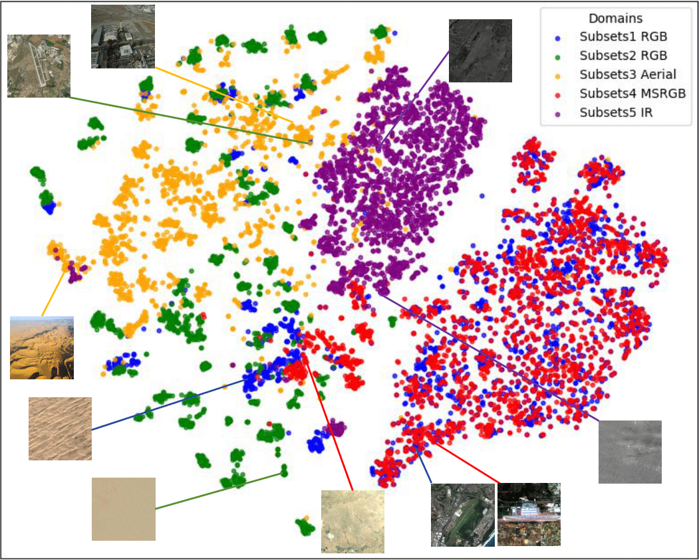
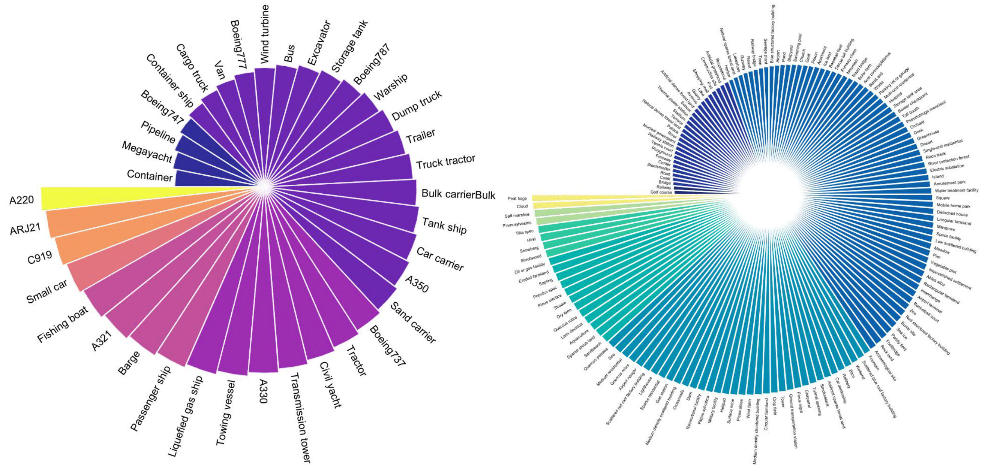

---
# Leave the homepage title empty to use the site title
title: ""
date: 2022-10-24
type: landing

design:
  # Default section spacing
  spacing: "0rem"

sections:
  - block: resume-biography-3
    content:
      # Choose a user profile to display (a folder name within `content/authors/`)
      # username: admin
      text: ""
    design:
      spacing:
        padding: ["265px", "0px", "270px", "0px"]  # 垂直30px/水平0
      css_class: dark
      background:
        color: white
        image:
          # Add your image background to `assets/media/`.
          filename: ICCV_intro.png
          filters:
            brightness: 1.0
          size: actual
          position: center
          parallax: false
  
  - block: markdown
    content:
      title: |
        <style> .no-wrap-center {white-space: nowrap; text-align: center;}</style><div class="no-wrap-center">OpenEarthSensing: Large-Scale Fine-Grained Open-World Remote Sensing Benchmark</div>

        <style>.center {text-align: center;}.link {font-size: 20px;text-decoration: none;}.link:hover {color: red; /* 改变链接颜色 */font-weight: bold; /* 改变链接文本的粗细 */cursor: pointer; /* 鼠标悬停时显示手型指示链接可点击 */}.separator {font-size: 20px;color: black;}</style><div class="center"><a href="https://arxiv.org/abs/2502.20668v2" class="link">[paper]</a> <span class="separator">|</span> <a href="https://www.kaggle.com/datasets/xiangexiang/openearthsensing-oes" class="link">[dataset]</a></div>

        <style>.text {font-size: 18px;line-height: 1.6;}strong {font-weight: bold;color: red;}</style><div class="text">Home page of the large-scale fine-grained open-world remote-sensing datasets and benchmark <strong>OpenEarthSensing (OES)</strong> for various open-world remote-sensing downstream tasks, mainly including evaluating the ability of models to detect semantic shifts, adapt to covariate shifts, and continuously update the parameters without forgetting learned knowledge. OES includes 189 scene and object categories, covering the vast majority of potential semantic shifts that may occur in the real world. To provide a more comprehensive testbed for evaluating the generalization performance, OES encompasses five data domains with significant covariate shifts, including two RGB satellite domains, one RGB aerial domain, one multi-spectral RGB domain, and one infrared domain.  </div>
      text: |-
      design:
        spacing:
          padding: ["0px", "0px", "0px", "0px"]  # 垂直30px/水平0

  - block: markdown
    content:
      title: |
      text: |
        
        ## 🎉 News
        [08/2025] 🔥 The OES dataset will be presented at the [Low-Altitude Intelligent Perception Computing and Applications Forum of China Multimedia 2025](https://haiv-lab.github.io/low-altitude/)

        [08/2025] 🔥 The OES dataset is available on kaggle.

        [07/2025] 🔥 The Second version of the OES paper is available on arXiv

        [02/2025] 🔥 The first version of the OES paper is available on arXiv.
        
      design:
        spacing:
          padding: ["0px", "0px", "0px", "0px"]  # 垂直30px/水平0

  - block: markdown
    id: highlights
    content:
      title: |
        
      text: |
        
        ## ✨ Highlights
        - **Multiple and diverse domains**: OES comprises five sub-datasets with five distinct domains, enabling it to serve as a testbed for various generalization tasks. We randomly select 2,000 images from each domain and utilize GeoRSCLIP to extract features. The t-SNE visualization is presented with each color representing a different domain. Notably, even though sub-dataset 1 and sub-dataset 2 both originate from satellite imagery, there is a significant domain shift due to the varying capturing conditions. Furthermore, satellite, aerial, and infrared images display considerable differences as well. These domain shifts highlight the significant evaluation values and challenges posed by OES. <div align=center> </div>
        - **Wide span of scales**: To accommodate the scale variations present in remote sensing images, OES has been curated to include a diverse range of data comprising 152 scenes and 37 objects for classification. To delve deeper into the intricacies of scale diversity within the OES dataset, *Qwen-VL-chat* is employed to evaluate the image scales associated with both scene and object categories. The distribution of OES across different scales is visually represented. The extensive spectrum of scale variations within OES introduces a novel challenge to the realm of remote sensing recognition. <div align=center> </div>
        - **Multiple coarse categories**: OES comprises 10 coarse-grained categories including *Vegetation*, *Agriculture*, *Aviation*, *Waterbody & Facilities*, *Resource Acquisition & Utilization*, *Land Transportation*, *Nature & Climate*, *Infrastructure*, *Industrial Facilities* and *Residential Building*, which effectively cover the majority of scenarios encountered in remote sensing applications. Each coarse-grained category is further divided into 10 to 27 fine-grained subcategories, culminating in a total of 189 distinct classifications.
        
    design:
        spacing:
          padding: ["0px", "0px", "0px", "0px"]  # 垂直30px/水平0.


  - block: markdown
    id: overview
    content:
      title: |
        
      text: |
        
        ## 👀 Overview of All Sub-Datasets
        

      design:
        spacing:
          padding: ["0px", "0px", "0px", "0px"]  # 垂直30px/水平0
  
  - block: resume-biography-3
    content:
      # Choose a user profile to display (a folder name within `content/authors/`)
      # username: admin
      text: ""
    design:
      spacing:
        padding: ["920px", "0px", "920px", "0px"]  # 垂直30px/水平0
      css_class: dark
      background:
        color: white
        image:
          # Add your image background to `assets/media/`.
          filename: web.png
          filters:
            brightness: 1.0
          size: actual
          position: center
          parallax: false

  - block: markdown
    id: citation
    content:
      title: |
        
      text: |
        
        ## 📖 Citation
        If you use OpenEarthSensing in your research, please cite our work:

        ```bibtex
        @article{xiang2025openearthsensing,
          title={OpenEarthSensing: Large-Scale Fine-Grained Open-World Remote Sensing Benchmark},
          author={Xiang, Xiang and Xu, Zhuo and Deng, Yao and Zhou, Qinhao and Liang, Yifan and Chen, Ke and Zheng, Qingfang and Wang, Yaowei and Chen, Xilin and Gao, Wen},
          journal={arXiv preprint arXiv:2502.20668},
          year={2025}
        }
        ```
        

  # - block: markdown
  #   content:
  #     text: |-
  #       [[paper]](https://arxiv.org/abs/2502.20668) \| [[code]](https://github.com/HAIV-Lab/openhaiv)        # <style>.center {text-align: center;}.adjust {font-size: 20px;}</style><div class="center"><div class="adjust"><a href="https://arxiv.org/abs/2502.20668">[paper]</a> | <a href="https://github.com/HAIV-Lab/openhaiv">[code]</a></div></div>
        
  # - block: markdown
  #   content:
  #     title: |
  #     subtitle: |
  #     text: |-
  #       [[paper]](https://arxiv.org/abs/2502.20668) \| [[code]](https://github.com/HAIV-Lab/openhaiv)

  # - block: collection
  #   id: overview
  #   content:
  #     title: Featured Publications
  #     filters:
  #       folders:
  #         - publication
  #       featured_only: true
  #   design:
  #     view: article-grid
  #     columns: 2

  # - block: collection
  #   content:
  #     title: Recent Publications
  #     text: ""
  #     filters:
  #       folders:
  #         - publication
  #       exclude_featured: false
  #   design:
  #     view: citation

  # - block: collection
  #   id: dataset
  #   content:
  #     title: Recent & Upcoming Talks
  #     filters:
  #       folders:
  #         - event
  #   design:
  #     view: article-grid
  #     columns: 1
    
  # - block: collection
  #   id: news
  #   content:
  #     title: Recent News
  #     subtitle: ''
  #     text: ''
  #     # Page type to display. E.g. post, talk, publication...
  #     page_type: post
  #     # Choose how many pages you would like to display (0 = all pages)
  #     count: 5
  #     # Filter on criteria
  #     filters:
  #       author: ""
  #       category: ""
  #       tag: ""
  #       exclude_featured: false
  #       exclude_future: false
  #       exclude_past: false
  #       publication_type: ""
  #     # Choose how many pages you would like to offset by
  #     offset: 0
  #     # Page order: descending (desc) or ascending (asc) date.
  #     order: desc
  #   design:
  #     # Choose a layout view
  #     view: date-title-summary
  #     # Reduce spacing
  #     spacing:
  #       padding: [0, 0, 0, 0]
  # - block: cta-card
  #   demo: true # Only display this section in the Hugo Blox Builder demo site
  #   content:
  #     title: 👉 Build your own academic website like this
  #     text: |-
  #       This site is generated by Hugo Blox Builder - the FREE, Hugo-based open source website builder trusted by 250,000+ academics like you.

  #       <a class="github-button" href="https://github.com/HugoBlox/hugo-blox-builder" data-color-scheme="no-preference: light; light: light; dark: dark;" data-icon="octicon-star" data-size="large" data-show-count="true" aria-label="Star HugoBlox/hugo-blox-builder on GitHub">Star</a>

  #       Easily build anything with blocks - no-code required!
        
  #       From landing pages, second brains, and courses to academic resumés, conferences, and tech blogs.
  #     button:
  #       text: Get Started
  #       url: https://hugoblox.com/templates/
  #   design:
  #     card:
  #       # Card background color (CSS class)
  #       css_class: "bg-primary-700"
  #       css_style: ""
---
